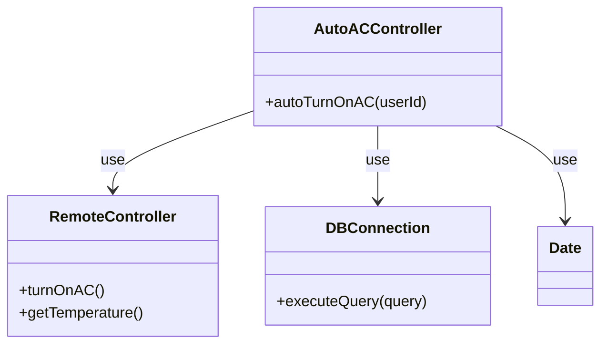
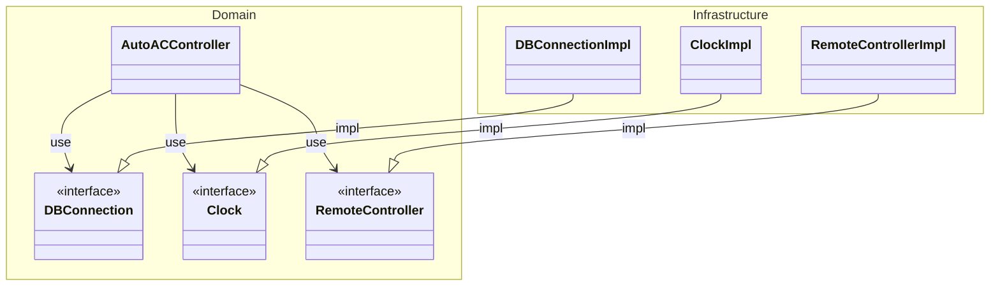

### 通常の実装

普通に実装すると、副作用のある処理に依存してしまい、テストが難しくなる

```mermaid

classDiagram

  class AutoACController
  AutoACController: +autoTurnOnAC(userId)

  class DBConnection
  DBConnection: +executeQuery(query)

  class RemoteController
  RemoteController: +turnOnAC()
  RemoteController: +getTemperature()


AutoACController --> RemoteController: use
AutoACController --> DBConnection: use
AutoACController --> Date: use


```

### Dependency Injection による Inversion of Control

処理は interface にのみ依存するようにする。
実際の実装は、別のレイヤーで実装され、使用時に依存関係として注入される。

```mermaid
classDiagram

namespace Domain {
  class AutoACController
  class DBConnection{
    <<interface>>
  }
  class Clock{
    <<interface>>
  }
  class RemoteController{
    <<interface>>
  }
}
namespace Infrastructure {
  class RemoteControllerImpl
  class DBConnectionImpl
  class ClockImpl
}


AutoACController --> RemoteController: use
AutoACController --> DBConnection: use
AutoACController --> Clock: use

RemoteControllerImpl --|> RemoteController: impl
DBConnectionImpl --|> DBConnection: impl
ClockImpl --|> Clock: impl


```
