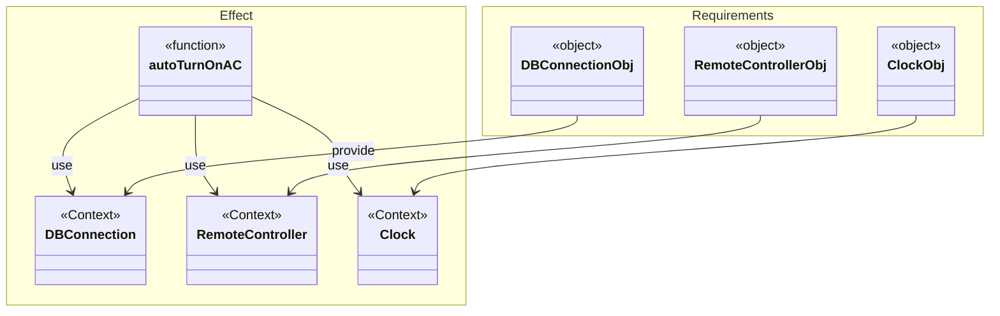

```mermaid

classDiagram

namespace Effect {
  class autoTurnOnAC {
    <<function>>
  }

  class DBConnection {
    <<Context>>
  }

  class RemoteController {
    <<Context>>
  }

  class Clock{
    <<Context>>
  }
}
namespace Requirements {
  class DBConnectionObj {
    <<object>>
  }
  class RemoteControllerObj {
    <<object>>
  }

  class ClockObj{
    <<object>>
  }
}

autoTurnOnAC --> RemoteController: use
autoTurnOnAC --> DBConnection: use
autoTurnOnAC --> Clock: use

DBConnectionObj --> DBConnection: provide
RemoteControllerObj --> RemoteController
ClockObj --> Clock


```
